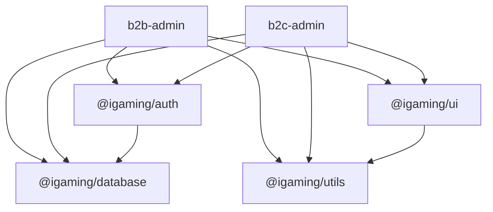

# Phase 3: Shared Code Extraction Plan

## Duplication Audit

### Exact duplicates

| Code | b2b-admin location | b2c-admin location | Target |
|---|---|---|---|
| `cn()` | _(not local)_ | `lib/utils.ts` | Already in `@igaming/ui` — delete local copy |
| `isNextRedirect()` | `app/login/actions.ts` | `app/login/actions.ts` | New `@igaming/utils` |
| `LoginActionState` type | `app/login/actions.ts` | `app/login/actions.ts` | New `@igaming/utils` |

### Near-duplicates / shared patterns

| Code | Location | Notes |
|---|---|---|
| `normalizeEmail()` | `schemas.ts` (b2b, standalone) + inline in both `auth.ts` | New `@igaming/utils` |
| `ActionResult` type | b2b `operator-admins/actions.ts` | New `@igaming/utils` (will grow with b2c features) |
| `SessionLike` type | `lib/authz-assert.ts` in both apps (b2c is superset of b2b) | New `@igaming/auth` as two named variants |
| `assertSuperAdminSession()` | b2b `lib/authz-assert.ts` | New `@igaming/auth` |
| `assertOperatorAdminSession()` | b2c `lib/authz-assert.ts` | New `@igaming/auth` |
| `canAccessB2BAdmin()` | b2b `lib/auth-policy.ts` | New `@igaming/auth` |
| `canAccessB2CAdmin()` | b2c `lib/auth-policy.ts` | New `@igaming/auth` |
| `hasActiveMembership()` | b2c `lib/auth-policy.ts` | New `@igaming/auth` (needs `@igaming/database`) |

### NOT extractable (app-bound)

- `logoutAction` — calls `signOut` from `@/auth` (NextAuth instance is per-app); bodies are identical but the dependency cannot be shared
- `loginAction` — calls `signIn` from `@/auth` and logic differs between apps
- `resolveOperatorFromHost` — b2c-only, uses `server-only` + `React.cache` + prisma; tightly coupled to multi-tenant routing
- Full `auth.ts` files — NextAuth config is inherently per-app

---

## Step 1 — Create `packages/utils/`

New package `@igaming/utils`. No runtime dependencies (pure TypeScript).

**New files:**
- [`packages/utils/package.json`](packages/utils/package.json) — name `@igaming/utils`, no deps
- [`packages/utils/tsconfig.json`](packages/utils/tsconfig.json)
- [`packages/utils/src/action-types.ts`](packages/utils/src/action-types.ts)

```typescript
export type ActionResult =
  | { ok: true; message: string }
  | { ok: false; message: string }

export type LoginActionState = { error?: string }
```

- [`packages/utils/src/string-helpers.ts`](packages/utils/src/string-helpers.ts)

```typescript
export function normalizeEmail(email: string): string {
  return email.trim().toLowerCase()
}
```

- [`packages/utils/src/next-helpers.ts`](packages/utils/src/next-helpers.ts)

```typescript
export function isNextRedirect(error: unknown): boolean {
  return (
    typeof error === 'object' &&
    error !== null &&
    'digest' in error &&
    typeof (error as { digest?: unknown }).digest === 'string' &&
    (error as { digest: string }).digest.startsWith('NEXT_REDIRECT')
  )
}
```

- [`packages/utils/index.ts`](packages/utils/index.ts) — re-exports all three modules

**Consumers updated:**
- `apps/b2b-admin/app/login/actions.ts` — remove local `isNextRedirect` + `LoginActionState`; import from `@igaming/utils`
- `apps/b2c-admin/app/login/actions.ts` — same
- `apps/b2b-admin/app/(dashboard)/operator-admins/actions.ts` — remove local `ActionResult`; import from `@igaming/utils`
- `apps/b2b-admin/app/(dashboard)/operator-admins/schemas.ts` — remove local `normalizeEmail`; import from `@igaming/utils`
- Both `auth.ts` files — replace inline `emailRaw.trim().toLowerCase()` with `normalizeEmail(emailRaw)`

**`package.json` additions** (both apps): add `"@igaming/utils": "workspace:*"` to dependencies.

---

## Step 2 — Create `packages/auth/`

New package `@igaming/auth`. Depends on `@igaming/database` (for `BackofficeRole` type and `hasActiveMembership` prisma call).

**New files:**
- [`packages/auth/package.json`](packages/auth/package.json) — name `@igaming/auth`, dep on `@igaming/database`
- [`packages/auth/tsconfig.json`](packages/auth/tsconfig.json)
- [`packages/auth/src/session-types.ts`](packages/auth/src/session-types.ts) — defines `SuperAdminSessionLike`, `OperatorAdminSessionLike`, `AuthenticatedSuperAdmin`, `AuthenticatedOperatorAdmin`. The two `SessionLike` variants replace the per-app type (b2c's is a superset; naming them explicitly avoids a confusing collision).
- [`packages/auth/src/assert.ts`](packages/auth/src/assert.ts) — `assertSuperAdminSession()` and `assertOperatorAdminSession()`, both imported from `session-types`
- [`packages/auth/src/policy.ts`](packages/auth/src/policy.ts) — `canAccessB2BAdmin()`, `canAccessB2CAdmin()`, `hasActiveMembership()` (the last one imports `prisma` from `@igaming/database`)
- [`packages/auth/index.ts`](packages/auth/index.ts) — re-exports all three modules

**Consumers updated:**
- `apps/b2b-admin/lib/auth-policy.ts` — delete file; update `auth.ts` import to `@igaming/auth`
- `apps/b2c-admin/lib/auth-policy.ts` — delete file; update `auth.ts` import to `@igaming/auth`
- `apps/b2b-admin/lib/authz-assert.ts` — delete file; `authz.ts` now imports `assertSuperAdminSession` + `AuthenticatedSuperAdmin` from `@igaming/auth`
- `apps/b2c-admin/lib/authz-assert.ts` — delete file; `authz.ts` now imports `assertOperatorAdminSession` + `AuthenticatedOperatorAdmin` from `@igaming/auth`

**`package.json` additions** (both apps): add `"@igaming/auth": "workspace:*"` to dependencies.

---

## Step 3 — Remove `cn` duplicate in b2c-admin

`apps/b2c-admin/lib/utils.ts` is byte-for-byte identical to `packages/ui/src/lib/utils.ts`, which is already exported as `@igaming/ui`'s `cn`.

- Delete [`apps/b2c-admin/lib/utils.ts`](apps/b2c-admin/lib/utils.ts)
- Update every b2c-admin import of `@/lib/utils` → `@igaming/ui`

No new package needed — `@igaming/ui` is already a dependency of b2c-admin.

---

## Dependency graph after extraction



Note: `@igaming/ui` already re-exports `cn` from its own `src/lib/utils.ts` — no change needed to the package itself.

---

## File delta summary

| Action | Files |
|---|---|
| Create | `packages/utils/` (5 files), `packages/auth/` (6 files) |
| Delete | `apps/b2c-admin/lib/utils.ts`, `apps/b2b-admin/lib/auth-policy.ts`, `apps/b2c-admin/lib/auth-policy.ts`, `apps/b2b-admin/lib/authz-assert.ts`, `apps/b2c-admin/lib/authz-assert.ts` |
| Update imports | 8 consumer files across both apps |
